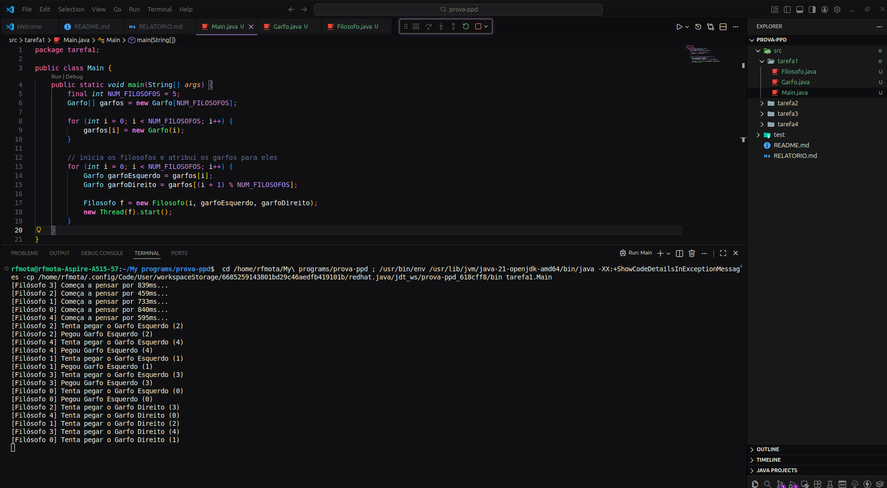
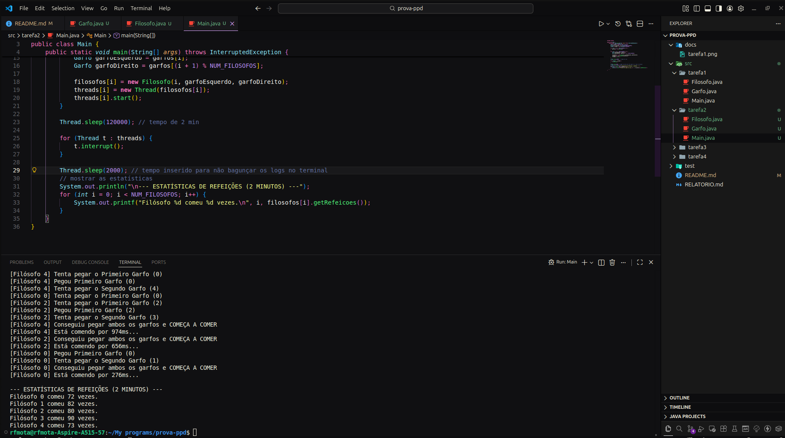
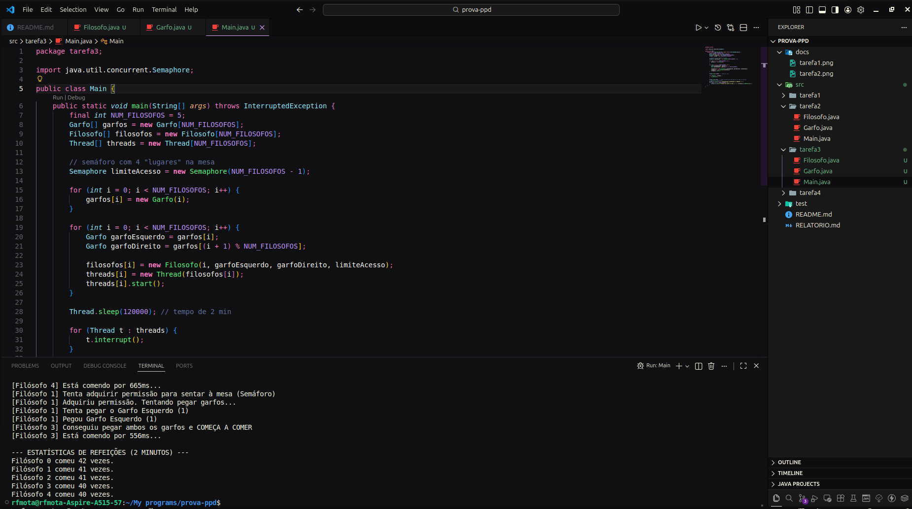
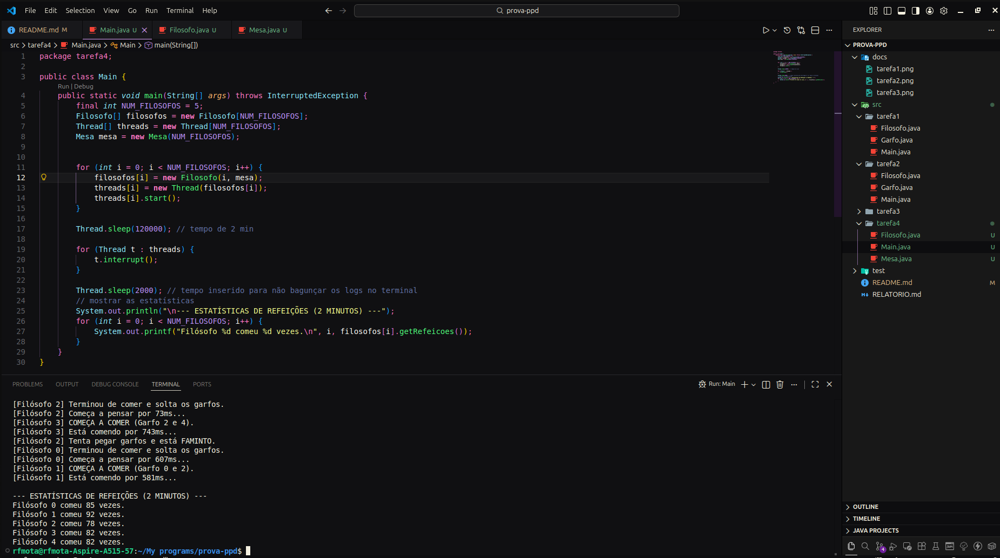

# Prova de Programação Paralela e Distribuída

Repositório destinado à relização da prova da materia de Programação Paralela e Distribuída.

## Tarefa 1

Na primeira tarefa, o deadlock conseguiu ser alcançado

> Nenhuma nova atividade foi detectada no terminal.

Para rodar, basta compilar o pacote e rodar a Main.java.

## Tarefa 2

Filosofos conseguiram comer por um tempo de 2 minutos.

> Estatísticas foram marcadas no terminal

Para rodar, basta compilar o pacote e rodar a Main.java.

## Tarefa 3

Filosofos conseguiram comer por um tempo de 2 minutos depois da implementação de semáforo.

> Estatísticas foram marcadas no terminal

Para rodar, basta compilar o pacote e rodar a Main.java.

## Tarefa 4

Foi criada a classe monitora `Mesa`, a classe `Garfo``não é mais utilizada.

Os filosofos conseguiram comer normalmente após a implementação da classe monitora.

Para rodar, basta compilar o pacote e rodar a Main.java.